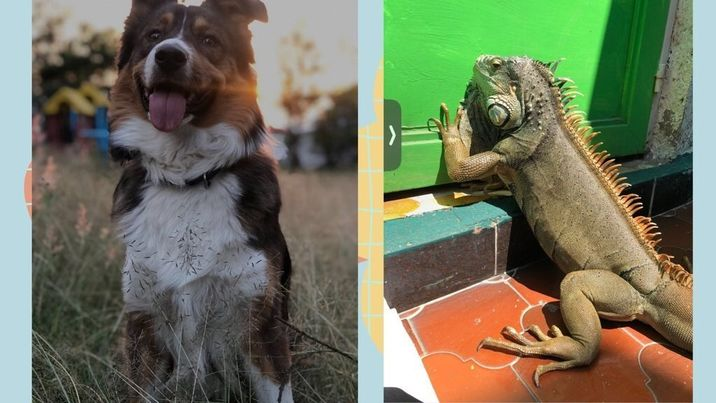

<!DOCTYPE html>
<html lang="en">
<head>
    <meta charset="UTF-8">
    <meta name="viewport" content="width=device-width, initial-scale=1.0">
    <title>Mich Gasca</title>
    <link rel="stylesheet" href="style.css">
</head>

<body>

    <header: class="header">

    <div: class="menu container">
        <a href="#" class="logo">¿Quién soy?</a>
        <id="menu">
        <label for="menu">    

    </label>
    <nav class="navbar">
        <ul>
            <li><a href="#">Sobre mi</a></li>
            <li><a href="#">links</a></li>
            <li><a href="#">Projets</a></li>
            </ul>
            
    </nav>
    

    

        <h1>MICH GASCA</h1>
        
Me llamo Michel Guadalupe, pero me pueden decir Mich, estudie Relaciones Internacionales, me gustan mucho los temas sobre humanidades y derechos humanos. Tengo un perrito llamado Albondiga y una iguana llamado Tequilo, ambos son adoptados y los amo mucho

        

        

    

    </header>
    

        <h2>LINKS</h2>
        <UL>
            <li> <a href="https://www.instagram.com/micchgasca/">intagram</a></li>
            <li><a href="https://www.linkedin.com/in/micheljgasca34/">Linkedin</a></li>
            <li><a href="https://github.com/dashboard">Github</a></li>
        </UL>
    

    
 
        <h3>PROJETS</h3>
        <ul>
            <li><a href="https://www.instagram.com/tequiloos/">Pagina de ventas</a></li>
        </ul>
    

    
</body>
</html>
